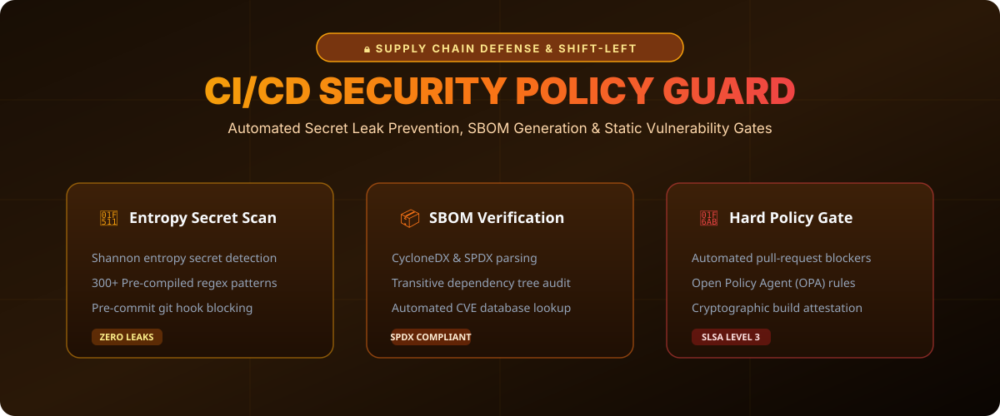

# Automated CI/CD Supply Chain Security Guardrail 🔒⚡



> **Deterministic shift-left security policy engine, secret leak detector, and container vulnerability evaluation gate for modern CI/CD pipelines.**

[](#)
[](https://opensource.org/licenses/MIT)
[](https://www.python.org/)

---

## 🛡️ Core Capabilities

- **Shannon Entropy Secret Detection**: Detects API keys, cryptographic tokens, and high-entropy private keys without relying only on static regex.
- **SLSA Level 3 Attestation**: Generates verifiable provenance for artifact packages before deployment.
- **Deterministic PR Blocking**: Rejects pull requests automatically if critical CVEs or secret leaks are present.

---

## 📁 Repository Layout

```tree
ci-cd-security-guardrail/
├── assets/
│   └── images/
│       └── guardrail_banner.svg     <-- Security Architecture Infographic
├── policy/
│   └── guardrail.py                 <-- Shannon Entropy Policy Evaluator
└── README.md                        <-- Comprehensive Documentation
```

---

## 🛠️ Quickstart

Run the policy scanner locally:

```bash
git clone https://github.com/nahidrahman147/ci-cd-security-guardrail.git
cd ci-cd-security-guardrail
python policy/guardrail.py
```

---

## 🤝 Contributing

Contributions in SBOM CycloneDX format parsers and GitHub Actions integrations are welcome!

**Maintained by @nahidrahman147** • *Built with GitHub REST API.*
